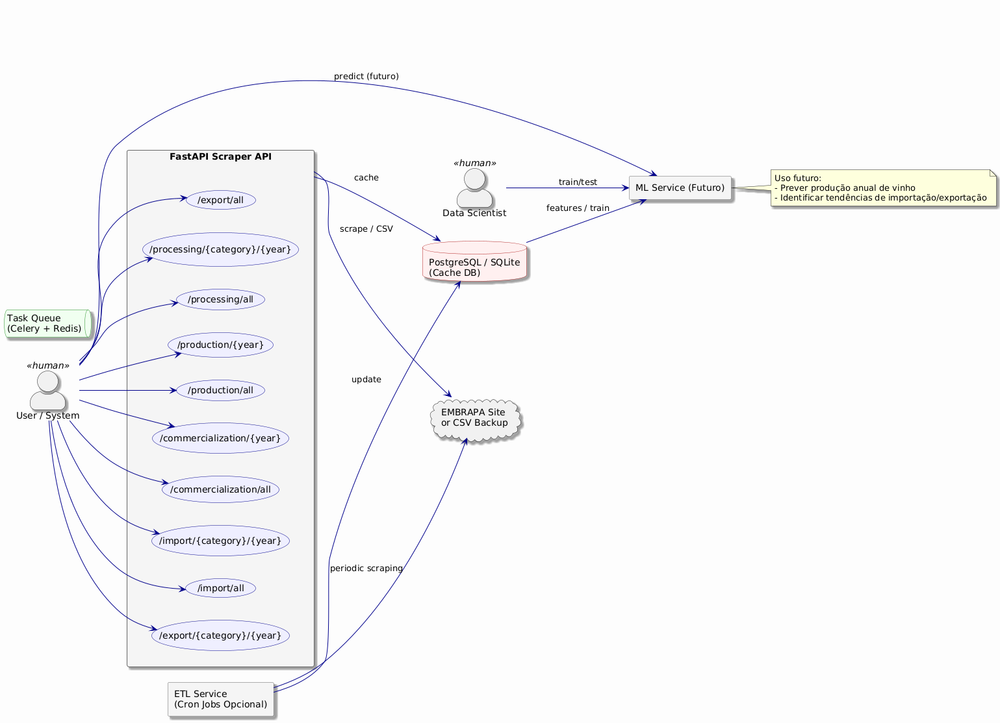

# ML Tech Challenge - Phase 1

This project is a solution to a machine learning challenge that involves scraping data from various sections (Production, Processing, Commercialization, Import, and Export) from the Embrapa website, and serving this data via a FastAPI application.

## Project Setup

Follow these steps to set up the project for the first time:

### Prerequisites

1. **Python 3.9+**: Make sure you have Python 3.9 or higher installed. You can check your Python version by running:
    ```bash
    python --version
    ```

2. **Poetry**: The project uses Poetry for dependency management. Install it by following the instructions at: https://python-poetry.org/docs/#installation

3. **Git**: To clone the project repository, you will need Git installed on your machine.

### Setup

1. Clone the repository:
    ```bash
    git clone https://github.com/yourusername/ml-techchallenge-01.git
    cd ml-techchallenge-01
    ```

2. Create a virtual environment and install dependencies with Poetry:
    ```bash
    poetry install
    ```

3. Activate the virtual environment:
    ```bash
    poetry shell
    ```

4. Run the application:
    ```bash
    uvicorn app.main:app --reload
    ```

Now, you should be able to access the application at `http://127.0.0.1:8000`.

## How to Test

The project uses `pytest` for running tests. To run the tests, follow these steps:

1. Make sure your virtual environment is activated (using `poetry shell`).

2. Run the tests with:
    ```bash
    pytest
    ```

3. To run tests with more detailed output, use:
    ```bash
    pytest -v
    ```

All test files are located in the `app/tests/` directory, and they cover the API routes and core logic.


## Project Structure

- **`app/`**: Main application code  
  - **`api/`**: FastAPI route handlers for each data tab  
    - `commercialization_tab_routes.py`  
    - `export_tab_routes.py`  
    - `import_tab_routes.py`  
    - `processing_tab_routes.py`  
    - `production_tab_routes.py`  
  - **`core/`**: Core utilities and constants  
    - `constants.py`  
    - `utils.py`  
  - **`data/`**: CSV files used for loading fallback or cached data  
    - Commercialization, export, import, processing, production CSVs  
  - **`scraping/`**: Web scraping logic for each data tab  
    - `commercialization_tab.py`  
    - `export_tab.py`  
    - `import_tab.py`  
    - `processing_tab.py`  
    - `production_tab.py`  
  - **`tests/`**: Test files and test configuration for API routes and core logic  
    - Tests for commercialization, export, import, processing, production routes  
  - `main.py`: Application entry point defining the FastAPI app and main routes  

- **`assets/`**: Project-related assets (e.g., architecture diagrams)  
- `LICENSE`: License file  
- `poetry.lock`: Dependency lock file managed by Poetry  
- `pyproject.toml`: Poetry configuration and dependencies  
- `README.md`: Project documentation  

## Architecture Overview



### License

This project is licensed under the MIT License - see the [LICENSE](LICENSE) file for details.
